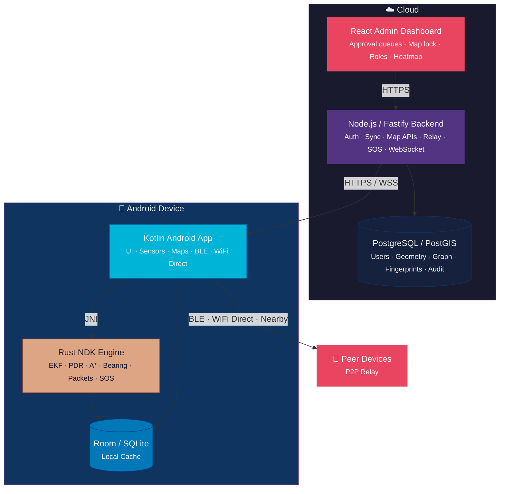
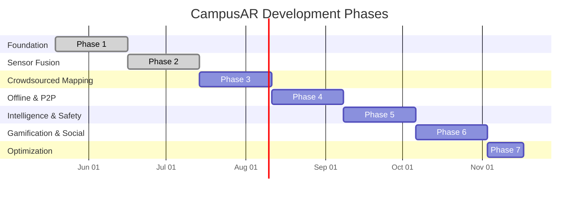
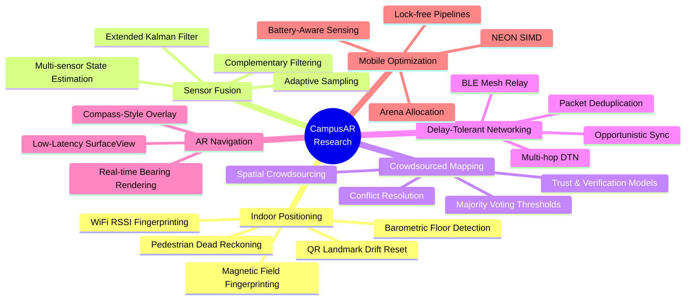
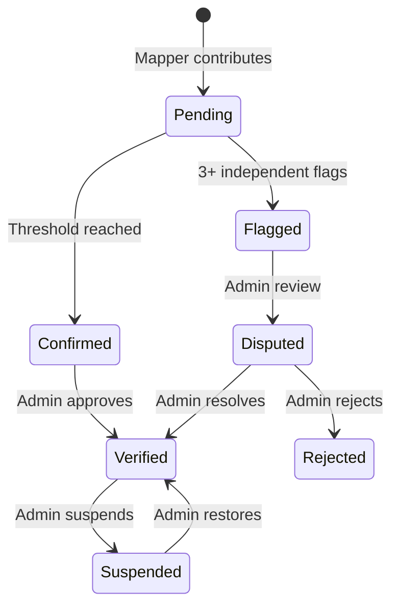

<p align="center">
  
  
  
  
  
  
</p>

<h1 align="center">🧭 CampusAR</h1>

<p align="center">
  <strong>Your campus. Mapped by everyone. Navigated by you.</strong>
</p>

<p align="center">
  <em>Offline-first Android campus navigation for Oriental College of Technology, Bhopal — with crowdsourced mapping, native sensor fusion, peer-to-peer sync, and a compass-style AR overlay.</em>
</p>

---

## 🌟 What is CampusAR?

CampusAR is an open, crowdsource-driven campus navigation system that works **with or without the internet**. Students, faculty, and visitors can navigate indoor and outdoor campus spaces using cached maps, real-time sensor fusion, walking routes, and a minimal AR compass overlay — all on devices as low-end as a Snapdragon 430 with 2 GB RAM.

The system is split into five modules: a **Kotlin Android app**, a **Rust NDK native engine**, a **Node.js + TypeScript backend**, a **PostgreSQL/PostGIS database**, and a **React admin dashboard** — each purpose-built for its role.

---

## ✨ Features

<table>
  <tr>
    <td width="50%">

**🗺️ Offline-First Navigation**
Route calculation, graph traversal, and map display work entirely from local cache. No server required.

**🔬 Native Sensor Fusion (Rust)**
GPS, accelerometer, gyroscope, magnetometer, and barometer fused via EKF/PDR at 50 Hz on a dedicated render thread.

**🧭 AR Compass Overlay**
Minimal `SurfaceView` overlay at ~60 fps with directional arrow, bearing ticks, arrival ring, and signal field background.

**📡 Peer-to-Peer Sync**
BLE, WiFi Direct, and Google Nearby Connections relay offline contributions through multi-hop DTN with deduplication.

**🆘 SOS System**
Triple-path alert: SMS → encrypted local contact, push → nearby online users, BLE → broadcast independent of internet.

  </td>
  <td width="50%">

**🏗️ Crowdsourced Mapping**
Verified users contribute nodes and paths. Confirmation thresholds, flags, and admin review ensure data quality.

**📍 Indoor Positioning**
PDR dead-reckoning, WiFi RSSI fingerprinting, magnetic fingerprinting, QR landmark drift reset, and barometer floor detection.

**🛤️ A\* Pathfinding**
Weighted campus graph with wheelchair-accessible route filtering, floor transitions, and turn anticipation.

**🔥 Occupancy Heatmap**
Anonymous zone-density aggregation updated every 60 seconds.

**👥 Buddy Tracking**
Real-time opt-in location sharing, not persisted, auto-stops outside campus geofence.

  </td>
  </tr>
</table>

> **7 user roles** — Visitor, Student, Staff, Faculty, Verified Mapper, Admin — with 7-day contribution cooldown and OTP-based college email verification (`oriental.ac.in`).

---

## 🏛️ Architecture



---

## 📦 Module Overview

| Module | Stack | Purpose |
|:---|:---|:---|
| [`android-app/`](android-app/) | Kotlin · Android SDK 35 · Room · CameraX · ML Kit | UI, sensors, WiFi scanning, QR anchor scanning, sensor fusion pipeline, fingerprint cache, compass AR overlay, floor indicator, local cache |
| [`native-engine/`](native-engine/) | Rust `cdylib` · JNI · Android NDK · nalgebra | EKF sensor fusion (6-state), PDR, A\* pathfinding, WiFi RSSI kNN matching, magnetic field matching, barometer floor detection, adaptive sampling, bearing smoothing, step detection |
| [`backend/`](backend/) | Node.js · TypeScript · Fastify · Drizzle | Auth, roles, map data APIs, delta sync, relay dedup, admin workflows, WebSocket live features |
| [`admin-dashboard/`](admin-dashboard/) | React _(planned)_ | Approval queues, disputes, thresholds, roles, map lock, occupancy heatmap |
| [`database/`](database/) | PostgreSQL · PostGIS | User data, campus geometry, path graph, fingerprints, sync cursors, audit |

---

## 🚀 Quick Start

### Prerequisites

| Tool | Version | Notes |
|:---|:---|:---|
| Node.js | 20+ | Backend runtime |
| Rust | stable | Native engine compilation |
| JDK | 17 | Android build requirement |
| Android SDK | API 35 | Target SDK |
| Android NDK | r27+ | Rust cross-compilation |
| Gradle | 8.x | Android build system |

### 1️⃣ Backend

```bash
cd backend
npm install
cp .env.example .env       # → configure JWT_SECRET, RESEND_API_KEY, DATABASE_URL
npm run check              # typecheck
npm test                   # run tests
npm run dev                # start dev server
```

### 2️⃣ Rust Native Engine (Host Tests)

```bash
cd native-engine
cargo test                 # run all unit tests
cargo fmt -- --check       # verify formatting
```

### 3️⃣ Android Build

```powershell
# Load the Android/Rust toolchain (JDK 17, SDK, NDK, Gradle)
. .\scripts\use-android-toolchain.ps1

# Cross-compile native .so for arm64-v8a + armeabi-v7a
.\native-engine\scripts\build-android.ps1

# Build the debug APK
gradle -p android-app :app:assembleDebug --stacktrace
```

> **APK output:** `android-app/app/build/outputs/apk/debug/app-debug.apk`

### 4️⃣ Database Migrations

```bash
cd backend
npx drizzle-kit push         # apply pending migrations
npx drizzle-kit generate     # generate migration from schema changes
```

---

## ✅ Verification Matrix

All modules can be independently verified. Run these before committing:

| Check | Command | Expected |
|:---|:---|:---|
| Backend typecheck | `cd backend && npm run check` | Clean exit |
| Backend tests | `cd backend && npm test` | All pass |
| Backend build | `cd backend && npm run build` | `dist/` emitted |
| Rust formatting | `cargo fmt --manifest-path native-engine/Cargo.toml -- --check` | No diffs |
| Rust tests | `cargo test --manifest-path native-engine/Cargo.toml` | All pass |
| Android debug APK | `gradle -p android-app :app:assembleDebug --stacktrace` | APK built |
| Native .so build | `.\native-engine\scripts\build-android.ps1` | `.so` files output |
| Admin JS syntax | `node --check admin-dashboard/app.js` | No errors |

---

## 🗓️ Phased Roadmap



| Phase | Status | Highlights |
|:---|:---|:---|
| **1 — Foundation** | ✅ Complete | Android scaffold, Rust engine, Fastify backend, Room cache, JWT auth, seed data model |
| **2 — Sensor Fusion** | ✅ Complete | nalgebra EKF (6-state), A\* pathfinding, PDR/step detection, WiFi RSSI kNN matching, magnetic field matching, barometer floor detection, adaptive sampling, QR anchor scanning (CameraX + ML Kit), sensor fusion pipeline, fingerprint cache, floor indicator UI |
| **3 — Crowdsourced Mapping** | 🔨 Next | Location contributions, voting thresholds, admin approval, React dashboard |
| **4 — Offline & P2P** | 📋 Planned | BLE/WiFi Direct relay, offline queue, delta sync, predictive caching |
| **5 — Intelligence & Safety** | 📋 Planned | Occupancy heatmap, SOS, lost person detection, path anomaly |
| **6 — Gamification & Social** | 📋 Planned | Points/badges/leaderboards, buddy tracking, faculty availability |
| **7 — Optimization** | 📋 Planned | NEON SIMD, arena allocator, benchmark validation on Snapdragon 430 |

---

## ⚡ Performance Targets

Designed to run smoothly on **Snapdragon 430** class devices with **2 GB RAM**:

| Metric | Target |
|:---|:---|
| EKF cycle latency | < 500 µs |
| AR overlay frame time | < 16.6 ms (60 fps) |
| Map tile rendering | ≥ 30 fps |
| Cold start | < 3 seconds |
| Steady-state RSS | < 150 MB |
| Battery drain (active nav) | < 8% / hour |
| Offline queue capacity | 10,000 packets |
| Spatial query (10k locations) | < 5 ms |

---

## 🔐 Design Decisions

| Decision | Rationale |
|:---|:---|
| **`SurfaceView` for AR** | Dedicated render thread avoids Compose frame drops on low-end devices |
| **Rust NDK for hot paths** | EKF, PDR, A\*, bearing, and packet encoding need sub-millisecond performance |
| **Offline-first architecture** | Navigation, pathfinding, and map display never depend on server connectivity |
| **Room + Rust persistence** | Room/SQLite for cached map data; Rust manages the offline queue and packet encoding natively |
| **JWT with HS256** | `jose`-based access + refresh token pattern; visitor mode requires no email |
| **Multi-transport P2P** | BLE (512-byte chunks) + WiFi Direct + Nearby Connections for maximum offline coverage |

---

## 📱 Device Validation

Successfully validated on **Redmi Note 10 Pro** (M2101K6P, Android 13, API 33):

| Check | Result |
|:---|:---|
| APK install & launch | ✅ Pass |
| Native library load (`libcampusar_native.so`) | ✅ Pass |
| Room database creation (`campus_ar.db`) | ✅ Pass |
| Accelerometer / Gyroscope / Magnetometer | ✅ Available |
| Barometer | ⚠️ Not available _(graceful degradation confirmed)_ |
| Crashes / ANRs / `UnsatisfiedLinkError` | ✅ None |

---

## 🔮 Open Items

- [ ] Real OCT campus geofence, building footprints, floor plans, and path graph — pending mapper walks
- [ ] PostgreSQL/PostGIS production hosting — migrations drafted, in-memory store active during dev
- [ ] Map SDK decision: OSMDroid vs Mapbox
- [ ] Resend sender domain verification for production OTP email
- [ ] Privacy thresholds for occupancy heatmap aggregation
- [ ] Institutional approvals for SOS, buddy tracking, and occupancy

---

## 📂 Project Structure

```
CampusAR/
├── android-app/           # Kotlin Android application
│   ├── app/src/main/
│   │   ├── java/          # Kotlin sources (UI, sensors, bridge)
│   │   ├── jniLibs/       # Cross-compiled Rust .so files (generated)
│   │   └── res/           # Layouts, drawables, values
│   └── build.gradle.kts
│
├── native-engine/         # Rust NDK crate
│   ├── src/               # EKF, PDR, A*, bearing, packets, SOS
│   ├── scripts/           # Android cross-compile scripts
│   └── Cargo.toml
│
├── backend/               # Node.js / TypeScript API server
│   ├── src/               # Fastify routes, auth, sync, schemas
│   ├── test/              # Integration tests
│   └── package.json
│
├── admin-dashboard/       # React admin dashboard (planned)
│   ├── index.html
│   ├── app.js
│   └── styles.css
│
├── database/              # PostgreSQL schema & seeds
│   ├── migrations/        # Drizzle-generated SQL
│   └── seeds/             # Initial campus data
│
└── scripts/               # Toolchain setup & build helpers
```

---

## 📚 Research & Academic Foundations

CampusAR draws on and contributes to several active research domains. This section documents the theoretical underpinnings, algorithmic foundations, and academic context relevant to each subsystem.

### Research Domains



### Research Paper Implementations

The following academic techniques are implemented in CampusAR. Each is a citable reference for the SRS, research paper submission, and hackathon documentation.

| Feature | Technique | Reference |
|:---|:---|:---|
| Sensor fusion | Extended Kalman Filter | Kalman, R.E. (1960). *A New Approach to Linear Filtering and Prediction Problems.* ASME Journal of Basic Engineering. |
| Indoor positioning | PDR with drift correction | *Indoor Positioning Using Pedestrian Dead Reckoning with Particle Filter.* IEEE Sensors Journal. |
| WiFi fingerprinting | RSSI-based positioning | Bahl & Padmanabhan (2000). *RADAR: An In-Building RF-Based User Location and Tracking System.* IEEE INFOCOM. |
| Magnetic fingerprinting | Magnetic field mapping | *Indoor Positioning Using Magnetic Field Map.* IEEE Transactions on Instrumentation and Measurement. |
| Offline relay | Delay-Tolerant Networking | Cerf et al. (2007). *Delay-Tolerant Networking Architecture.* RFC 4838, IRTF. |
| Crowd confirmation | Majority voting with trust weights | *Truth Discovery in Crowdsourced Data.* ACM KDD. |
| Federated learning (v2) | Federated Averaging | McMahan et al. (2017). *Communication-Efficient Learning of Deep Networks from Decentralized Data.* Google AI. |
| Path confidence | Usage-weighted graph edges | Dijkstra, E.W. (1959). *A note on two problems in connexion with graphs.* Numerische Mathematik. |
| Low-end performance | SIMD on ARM | *ARM NEON Programmer's Guide.* ARM Holdings. |
| Predictive caching | Trajectory-based prefetch | *Trajectory-Aware Mobile Data Prefetching.* ACM MobiSys. |

---

### 1. Indoor Positioning Systems (IPS)

CampusAR implements a **hybrid indoor positioning** approach that fuses multiple modalities with cascading fallback:

| Technique | Module | Accuracy Target | Fallback Priority |
|:---|:---|:---|:---|
| GPS Anchor | `sensors/fusion.rs` | 3–10 m (outdoor) | Primary (outdoor) |
| PDR (Pedestrian Dead Reckoning) | `sensors/pdr.rs` | ~2–5 m drift/min | Primary (indoor) |
| WiFi RSSI Fingerprinting | `sensors/wifi_rssi.rs` | 2–5 m | Secondary |
| Magnetic Field Fingerprinting | `sensors/magnetic.rs` | 1–3 m | Tertiary |
| QR Landmark Snap | App + `mapping/location.rs` | Sub-meter | Drift reset |
| Barometric Floor Detection | `sensors/barometer.rs` | ±1 floor | Floor switching |

**Key algorithmic contributions:**
- **Cascading fallback chain** — the system dynamically selects the best available positioning modality based on sensor availability, signal quality, and indoor/outdoor context, rather than relying on a fixed strategy.
- **QR-anchored drift reset** — periodic QR scans at known indoor landmarks snap the estimated position to ground truth, bounding cumulative PDR drift.
- **Graceful degradation matrix** — positioning continues with reduced accuracy when optional sensors (barometer, WiFi, magnetometer) are unavailable, rather than failing.

**Foundational literature:**
- Liu, H. et al. (2007). "Survey of Wireless Indoor Positioning Techniques and Systems." *IEEE Trans. Syst., Man, Cybern. C*, 37(6), 1067–1080.
- Davidson, P. & Piché, R. (2017). "A Survey of Selected Indoor Positioning Methods for Smartphones." *IEEE Commun. Surveys Tuts.*, 19(2), 1347–1370.
- Xiao, J. et al. (2016). "A Survey on Wireless Indoor Localization from the Device Perspective." *ACM Computing Surveys*, 49(2), 25:1–25:31.
- Harle, R. (2013). "A Survey of Indoor Inertial Navigation Systems for Pedestrians." *IEEE Commun. Surveys Tuts.*, 15(3), 1281–1293.

---

### 2. Sensor Fusion & State Estimation

The native engine implements an **Extended Kalman Filter (EKF)** for multi-sensor state estimation, fusing:

- **Accelerometer** — step detection, motion classification
- **Gyroscope** — angular velocity, heading rate
- **Magnetometer** — absolute heading reference
- **GPS** — outdoor position anchor
- **Barometer** — altitude/floor estimation

**State vector design:**

```
x = [latitude, longitude, heading, velocity, step_length, floor_index]ᵀ
```

**Implementation approach:**
- Phase 1 uses a **complementary filter** for heading (gyro + magnetometer blend) as a lightweight initial solution.
- Phase 2+ targets a full **matrix EKF** using `nalgebra` at 50 Hz with adaptive sampling — reducing to lower rates when stationary or screen-off for battery conservation.
- Motion-state classification (stationary, walking, running) drives adaptive sensor sampling rates.

**Performance constraints (SRS-mandated):**
- EKF cycle: < 500 µs on Snapdragon 430
- CPU usage: < 8% steady-state
- Sampling: 50 Hz when moving, adaptive downsampling when idle

**Foundational literature:**
- Welch, G. & Bishop, G. (1995). "An Introduction to the Kalman Filter." *UNC Chapel Hill TR 95-041*.
- Foxlin, E. (2005). "Pedestrian Tracking with Shoe-Mounted Inertial Sensors." *IEEE CG&A*, 25(6), 38–46.
- Jiménez, A. R. et al. (2009). "A Comparison of Pedestrian Dead-Reckoning Algorithms using a Low-Cost MEMS IMU." *WISP 2009*, 37–42.
- Groves, P. D. (2013). *Principles of GNSS, Inertial, and Multisensor Integrated Navigation Systems*. 2nd ed. Artech House.

---

### 3. Crowdsourced Spatial Mapping

CampusAR's map is **entirely crowdsourced** — no pre-existing GIS dataset is used. The verification pipeline implements a multi-layer trust model:



**Trust & verification mechanisms:**
- **Confirmation radius** — users must be within 15 m (configurable) to confirm a location
- **One-confirmation-per-user rule** — prevents sybil-style ballot stuffing
- **Threshold-based promotion** — locations require N independent confirmations before admin review
- **7-day cooldown** — new accounts cannot contribute map data for 7 days after registration
- **Conflict detection** — duplicate coordinates with conflicting labels are auto-flagged for dispute review
- **Walk count tracking** — path edges track traversal counts as a proxy for reliability

**Novel aspects:**
- **Zero-seed-data bootstrap** — the system is designed to build a complete campus graph from scratch using only verified mapper walks, with no imported GIS/CAD data required.
- **Provisional coordinate lifecycle** — all contributed coordinates pass through `field_collected → provisional → pending_admin_review → verified` states before being trusted for navigation.

**Foundational literature:**
- Kazemi, L. & Shahabi, C. (2012). "GeoCrowd: Enabling Query Answering with Spatial Crowdsourcing." *ACM SIGSPATIAL GIS 2012*, 189–198.
- Goodchild, M. F. (2007). "Citizens as Sensors: The World of Volunteered Geography." *GeoJournal*, 69(4), 211–221.
- Haklay, M. (2010). "How Good Is Volunteered Geographical Information? A Comparative Study of OpenStreetMap and Ordnance Survey Datasets." *Env. & Planning B*, 37(4), 682–703.
- Mooney, P. & Corcoran, P. (2012). "The Annotation Process in OpenStreetMap." *Trans. in GIS*, 16(4), 561–579.

---

### 4. Delay-Tolerant Networking & P2P Sync

CampusAR's offline relay system implements a **store-carry-forward** DTN architecture:

```
Device A (offline) ──BLE──▶ Device B (offline) ──WiFi Direct──▶ Device C (online) ──HTTPS──▶ Server
```

**Protocol design:**
- **Multi-transport discovery** — BLE, WiFi Direct, and Google Nearby Connections are used concurrently for maximum peer reachability
- **512-byte BLE chunking** — packets are split to fit BLE MTU constraints, with reassembly and integrity checks
- **Content-addressed deduplication** — SHA-256 packet hashes prevent duplicate relay processing across multi-hop paths
- **TTL-based loop prevention** — relay packets carry a hop-count TTL to prevent infinite forwarding loops
- **Server-authoritative dedup** — the backend maintains a hash set and rejects already-processed packets with explicit `duplicate` responses

**Delta sync protocol:**
- Server-issued monotonic **sync cursors** track each device's last-seen state
- Only records changed since the cursor are transmitted
- Offline contributions are queued in a Rust-managed persistent queue (capacity: 10,000 packets)
- Conflict resolution for delayed offline edits surfaces to admin review when auto-merge is unsafe

**Foundational literature:**
- Fall, K. (2003). "A Delay-Tolerant Network Architecture for Challenged Internets." *ACM SIGCOMM 2003*, 27–34.
- Pelusi, L. et al. (2006). "Opportunistic Networking: Data Forwarding in Disconnected Mobile Ad Hoc Networks." *IEEE Commun. Mag.*, 44(11), 134–141.
- Vahdat, A. & Becker, D. (2000). "Epidemic Routing for Partially-Connected Ad Hoc Networks." *Duke University TR CS-2000-06*.
- Demmer, M. et al. (2008). "Implementing Delay Tolerant Networking." *Intel Research TR IRB-TR-04-020*.

---

### 5. Augmented Reality Navigation

CampusAR uses a **compass-style AR overlay** rather than full camera-based AR, optimized for low-end devices:

**Rendering architecture:**
- Custom `SurfaceView` with a **dedicated render thread** — decoupled from the main UI thread to maintain 60 fps
- No dependency on ARCore/ARKit — works on any device with a magnetometer
- Render pipeline: sensor data → Rust bearing computation → JNI → Kotlin overlay state → SurfaceView draw

**Visual elements:**
| Element | Purpose | Update Rate |
|:---|:---|:---|
| Directional arrow | Points toward destination | Every frame (~60 fps) |
| Bearing ticks | Compass cardinal markers | Every frame |
| Distance text | Meters to destination | Every position update |
| Arrival ring | Proximity visual feedback | Animated on approach |
| Signal field background | Signal quality indicator | Every 1s |
| Floor indicator | Current/target floor | On floor change |
| Turn anticipation | Upcoming direction change | Before graph node |

**Design rationale:**
- Jetpack Compose is explicitly avoided for the AR overlay due to frame-drop risk on Snapdragon 430
- The `SurfaceView` approach allows double-buffered rendering with minimal garbage collection pressure
- Haptic feedback and procedural sound are triggered through a `RewardEngine` event queue with 300 ms inter-event gaps

**Foundational literature:**
- Reitmayr, G. & Drummond, T. (2006). "Going Out: Robust Model-Based Tracking for Outdoor Augmented Reality." *IEEE/ACM ISMAR 2006*, 109–118.
- Mulloni, A. et al. (2011). "Handheld Augmented Reality Indoor Navigation with Activity-Based Instructions." *MobileHCI 2011*, 211–220.
- Chung, J. et al. (2016). "Indoor Navigation System Using Image Processing." *MobiSys 2016*.
- Dünser, A. et al. (2012). "Applying HCI Principles to AR Systems Design." *Mixed Reality Workshop*.

---

### 6. Mobile Performance Optimization

The system targets **Snapdragon 430 / 2 GB RAM** as the baseline — demanding aggressive optimization:

| Optimization | Technique | Phase |
|:---|:---|:---|
| **NEON SIMD** | Vectorized EKF matrix math for ARM | Phase 7 |
| **Arena allocation** | Zero-alloc A\* pathfinding with pre-allocated node pools | Phase 7 |
| **Lock-free sensor pipeline** | Ring buffer between sensor thread and fusion thread | Phase 7 |
| **Stack-buffer serialization** | Packet encoding without heap allocation | Phase 7 |
| **LRU tile cache** | Active tile + 8 neighbors, memory-bounded eviction | Phase 7 |
| **Memory-mapped fingerprints** | `mmap` for fingerprint DB to avoid loading into heap | Phase 7 |
| **Adaptive sensor batching** | Reduce sampling rate when stationary/screen-off | Phase 2 ✅ |
| **Release-profile tuning** | LTO, `panic=abort`, strip, `codegen-units=1` | Phase 1 ✅ |

**Cross-compilation targets:**
- `arm64-v8a` (AArch64) — primary target for modern devices
- `armeabi-v7a` (ARMv7) — fallback for older 32-bit devices

**Foundational literature:**
- Hao, T. et al. (2017). "Poster: Achieving Continuous Sensing on Smartphone Using Resource-Aware Scheduling." *MobiSys 2017*.
- Priyantha, N. B. et al. (2011). "LittleRock: Enabling Energy-Efficient Continuous Sensing on Mobile Phones." *Pervasive Computing*, 10(2), 12–15.
- Paek, J. et al. (2010). "Energy-Efficient Rate-Adaptive GPS-Based Positioning for Smartphones." *MobiSys 2010*, 299–314.
- Constandache, I. et al. (2010). "EnLoc: Energy-Efficient Localization for Mobile Phones." *IEEE INFOCOM 2010*, 1–9.

---

### 7. Federated Learning (v2)

CampusAR's Phase 2 roadmap introduces **Federated Averaging** for collaborative model improvement without centralizing raw sensor data:

**Approach:**
- WiFi RSSI fingerprint models and magnetic field maps are trained locally on each device using sensor data collected during navigation
- Only model gradient updates (not raw data) are shared with the server via **Federated Averaging (FedAvg)**
- The server aggregates updates from multiple devices to improve global positioning models
- Privacy is preserved: no raw fingerprint scans or location traces leave the device

**Design rationale:**
- Campus WiFi environments change over time (AP reconfigurations, furniture, seasonal effects) — federated updates allow the fingerprint model to adapt continuously
- Bandwidth-efficient: gradient deltas are orders of magnitude smaller than raw fingerprint databases
- Naturally aligns with CampusAR's privacy-by-design architecture

**Foundational literature:**
- McMahan, H. B. et al. (2017). "Communication-Efficient Learning of Deep Networks from Decentralized Data." *AISTATS 2017*. Google AI.
- Konečný, J. et al. (2016). "Federated Learning: Strategies for Improving Communication Efficiency." *arXiv:1610.05492*.
- Li, T. et al. (2020). "Federated Learning: Challenges, Methods, and Future Directions." *IEEE Signal Processing Magazine*, 37(3), 50–60.

---

### 8. Path Confidence & Usage-Weighted Routing

CampusAR's pathfinding uses **usage-weighted graph edges** to prioritize well-traveled, crowd-verified routes:

**Approach:**
- Each edge in the campus navigation graph carries a **walk count** — incremented each time a user traverses the path
- Edge weights are inversely proportional to walk count: frequently used paths receive lower traversal cost
- A* pathfinding (and fallback Dijkstra) prefer routes with higher crowd confidence, naturally avoiding untested or rarely used paths
- Admin-verified paths receive a weight bonus, further reinforcing trusted routes

**Design rationale:**
- In a crowdsourced map with no initial dataset, early contributions may contain errors — usage weighting provides a self-correcting mechanism
- High-traffic paths are inherently more likely to be accurate, accessible, and safe
- The approach is inspired by Dijkstra's shortest-path algorithm extended with dynamic, crowd-derived edge costs

**Foundational literature:**
- Dijkstra, E.W. (1959). "A note on two problems in connexion with graphs." *Numerische Mathematik*, 1(1), 269–271.
- Hart, P.E., Nilsson, N.J. & Raphael, B. (1968). "A Formal Basis for the Heuristic Determination of Minimum Cost Paths." *IEEE Trans. Syst. Sci. Cybern.*, 4(2), 100–107.
- Delling, D. et al. (2009). "Engineering Route Planning Algorithms." *Algorithmics of Large and Complex Networks*, LNCS 5515, 117–139.

---

### 9. Predictive Caching & Trajectory-Based Prefetch

CampusAR implements **trajectory-based predictive caching** to pre-load map tiles and navigation data before the user needs them:

**Approach:**
- The system predicts the user's near-future trajectory based on current heading, velocity, and the active navigation route
- Map tiles, fingerprint data, and graph segments along the predicted path are prefetched into the LRU cache
- Prefetch priority is weighted by route confidence and distance — high-confidence next segments are fetched first
- Cache eviction follows an LRU policy bounded by memory constraints (targeting < 150 MB RSS)

**Design rationale:**
- On low-end devices with limited bandwidth and storage, loading map data on-demand causes visible stutter and navigation lag
- Trajectory prediction allows seamless tile transitions, especially during indoor-outdoor handoffs where multiple data sources change simultaneously
- The approach reduces perceived latency and improves the offline experience by ensuring relevant data is cached before connectivity is lost

**Foundational literature:**
- Higgins, B.D. et al. (2012). "Informed Mobile Prefetching." *ACM MobiSys 2012*, 155–168.
- Balasubramanian, N. et al. (2009). "Energy Consumption in Mobile Phones: A Measurement Study and Implications for Network Applications." *ACM IMC 2009*, 280–293.
- Xu, Q. et al. (2013). "Trajectory-Aware Mobile Data Offloading." *IEEE/ACM Trans. Netw.*, 23(3), 898–911.

---

### Novel Contributions of CampusAR

CampusAR combines several well-studied techniques into a system with unique properties:

| Contribution | Description |
|:---|:---|
| **Zero-dataset campus bootstrap** | Complete campus navigation graph built entirely from crowdsourced mapper walks — no GIS import, no CAD data, no institutional dataset required |
| **Triple-path SOS** | Emergency alerts via SMS + push notification + BLE broadcast simultaneously, ensuring delivery independent of connectivity state |
| **Rust-native sensor fusion on Android** | EKF/PDR running in Rust via NDK/JNI at 50 Hz — combining Rust's safety guarantees with native performance on constrained ARM hardware |
| **Offline-first with DTN relay** | Full navigation capability without any network; offline map contributions relay through BLE/WiFi Direct mesh to reach the server eventually |
| **Privacy-by-design occupancy** | Anonymous zone-density aggregation with no individual location traces stored — privacy threshold enforced at the protocol level |
| **Multi-modal indoor fallback chain** | GPS → PDR → WiFi RSSI → Magnetic → QR snap, with runtime fallback based on sensor availability and signal quality |

### Keywords

`Indoor Positioning` · `Pedestrian Dead Reckoning` · `Extended Kalman Filter` · `WiFi Fingerprinting` · `Magnetic Fingerprinting` · `Crowdsourced Mapping` · `Spatial Crowdsourcing` · `Volunteered Geographic Information` · `Delay-Tolerant Networking` · `BLE Mesh` · `Opportunistic Networking` · `Augmented Reality Navigation` · `Campus Navigation` · `Offline-First Architecture` · `A* Pathfinding` · `Android NDK` · `Rust FFI` · `Sensor Fusion` · `Mobile Optimization` · `PostGIS`

### Suggested Citation

```bibtex
@software{campusar2026,
  title     = {CampusAR: Offline-First Crowdsourced Campus Navigation with
               Native Sensor Fusion and Delay-Tolerant P2P Sync},
  author    = {Oriental College of Technology, Bhopal},
  year      = {2026},
  url       = {https://github.com/your-org/campusar},
  note      = {Software Requirements Specification v1.0, June 2026}
}
```

---

## 🤝 Contributing

1. Read [`AGENTS.md`](AGENTS.md) for module boundaries and commit rules
2. Check [`CODEX_HANDOFF.md`](CODEX_HANDOFF.md) before cross-module work
3. Follow the verification matrix above before pushing
4. AI-authored commits must include a `Co-Authored-By:` vishal

---

